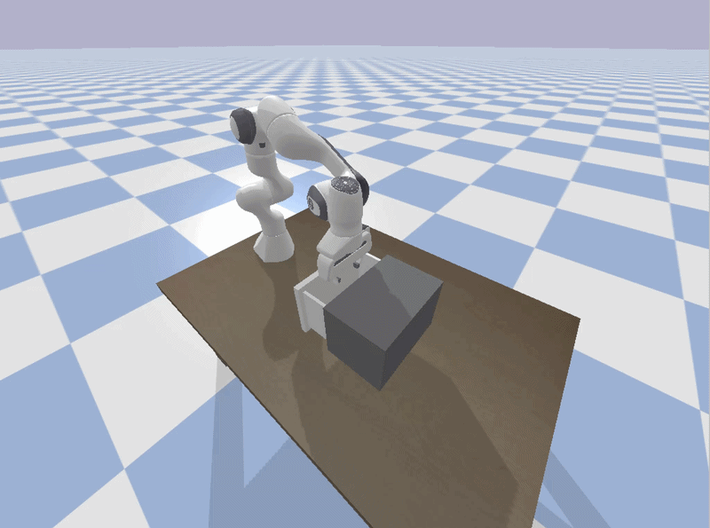

# HW9

Dylan Losey, Virginia Tech.

In this homework assignment we will explore different techniques for improving an imitation learning policy.

## Install and Run

```bash

# Download
git clone https://github.com/vt-hri/HW9.git
cd HW9

# Create and source virtual environment
# If you are using Mac or Conda, modify these two lines as shown in [HW0](https://github.com/vt-hri/HW0)
# If you have previously created a virtual environment with torch, you can just source that environment
python3 -m venv venv
source venv/bin/activate

# Install dependencies
# If you are using Mac or Conda, modify this line as shown in [HW0](https://github.com/vt-hri/HW0)
pip install numpy pybullet torch

# Run the script
python get_dataset.py
```

## Expected Output



## Assignment

You are given the code for training an imitation learning policy using behavior cloning.
We only have access to 10 demonstrations, and we cannot increase the size of the dataset.
What techniques could we use to try and extract better policies from the offline data?
This assignment encourages you to try and experiment with different options.
Complete the following steps:

1. Run the code and train a model. Test your model. You likely observe that the learned model is ok, but not perfect. Try varying the hyperparameters to improve the robot's learned policy.
2. One idea for improving the policy is to "upsample" the given data. Using the `upsample_data.py` code, try building a larger dataset from your given dataset. Explain how this code works. When does it succeed, and when does it fail?
3. Another idea for improving the policy is to condition on not just the robot's current state, but a state history. Modify the training pipeline so that the robot reasons over this state history at runtime. Does it improve your policy? Explain why this method could help or hurt your learned policy.
4. Develop your own method for improving the robot's learned policy. This could be your own idea, or perhaps a combination of steps 2 and 3. You could experiment with other model structures and loss functions. Report the effectiveness of your proposed method, and explain why it did or did not work.